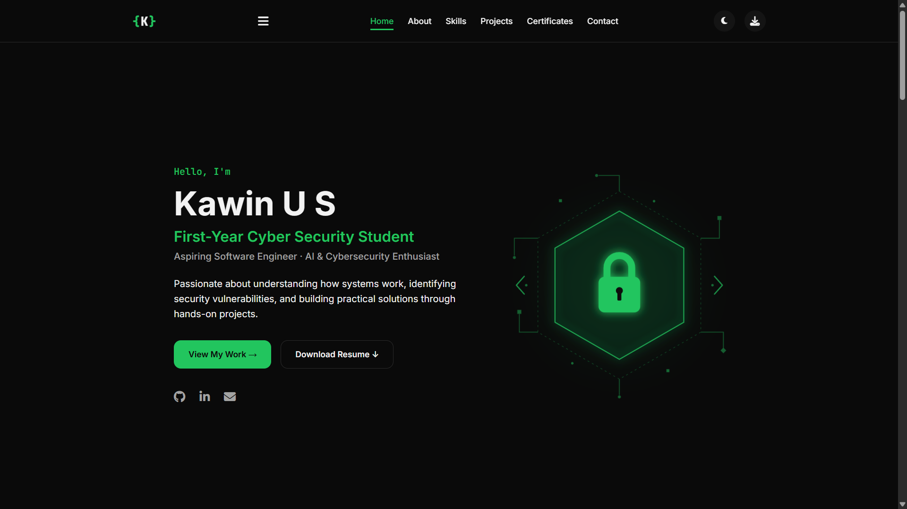
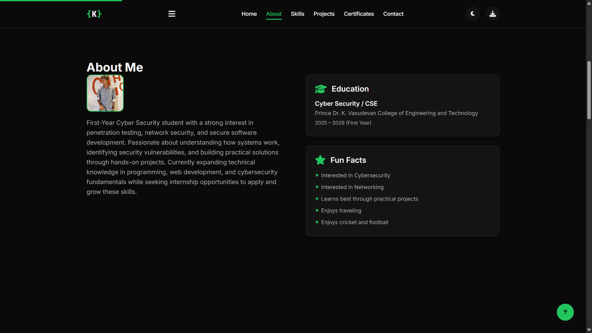
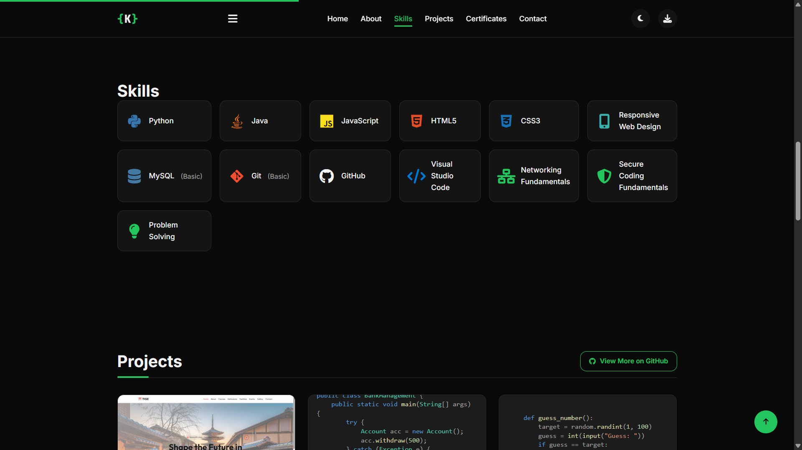
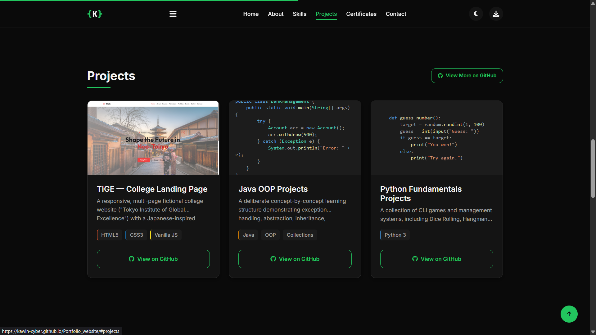
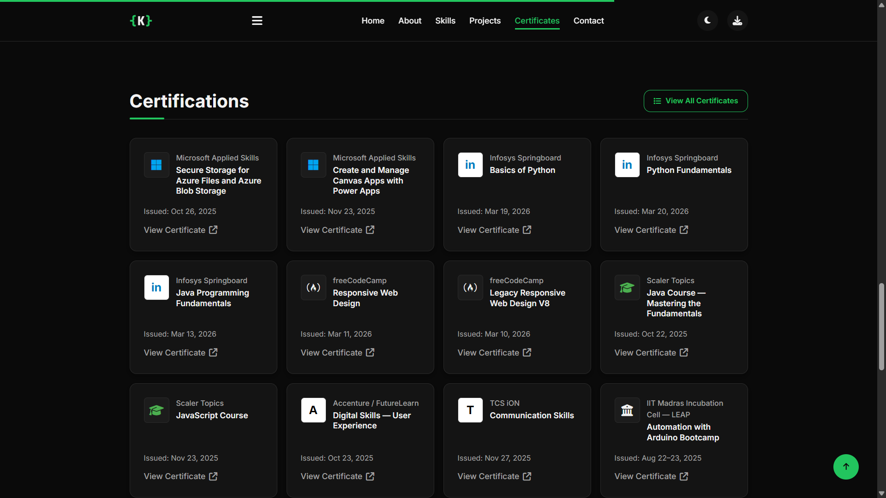
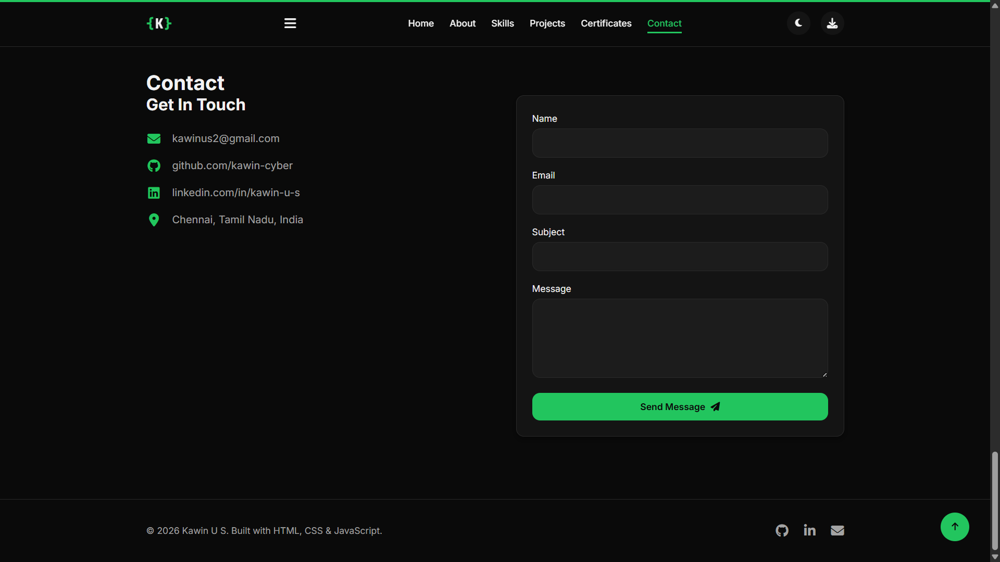

# Kawin U S — Personal Portfolio

A responsive personal portfolio website built with vanilla HTML, CSS, and JavaScript — no frameworks, no build step. Showcases my skills, projects, and certifications as a first-year Cyber Security student.

🔗 **Live site:** [(https://kawin-cyber.github.io)](https://kawin-cyber.github.io/Portfolio_website/) 

---
## About Me

I'm a student with a growing interest in cybersecurity and networking. My curiosity started with the idea of hacking, but it quickly expanded into understanding how systems, networks, and security mechanisms work behind the scenes.

I enjoy learning through hands-on projects, exploring security concepts, and building practical solutions. While I'm still early in my cybersecurity journey, I focus on developing strong technical foundations and continuously improving my skills.

---
## 📁 Project Structure

```
.
├── index.html
├── styles.css
├── script.js
├── resume.pdf
├── img/
│   ├── hero-illustration.svg
│   ├── hero-image.jpg
│   ├── profile_image2.jpeg
│   └── tige-screenshot.png
└── Certificates/
    ├── AI_Fluency_Learning_Series_16_Courses.pdf
    ├── Automation_with_Arduino_Bootcamp.pdf
    ├── Basics_of_Python.pdf
    ├── Communication_Skills.pdf
    ├── Create_and_Manage_Canvas_Apps_with_Power_Apps.pdf
    ├── Digital_Skills_User_Experience.pdf
    ├── English_Certificate_B2_Upper_Intermediate.pdf
    ├── Java_Course_Mastering_the_Fundamentals.pdf
    ├── Java_Programming_Fundamentals.pdf
    ├── JavaScript_Course.pdf
    ├── Legacy_Responsive_Web_Design_V8.pdf
    ├── Python_Fundamentals.pdf
    ├── Responsive_Web_Design.pdf
    └── Secure_Storage_for_Azure_Files_and_Azure_Blob_Storage.pdf
```

---
## ✨ Features

### 🎨 Design & User Experience

* Responsive layout optimized for desktop, tablet, and mobile devices
* Clean, modern personal portfolio design
* Light and dark theme toggle with user preference saved via `localStorage`
* Slide-in mobile navigation menu
* Smooth scrolling and hover transitions
* Active navigation highlighting based on scroll position

### 🚀 Interactive Experience

* Scroll reveal animations using `IntersectionObserver`
* Accessibility-friendly animations that respect `prefers-reduced-motion`
* Dynamic theme switching without page reload
* Smooth section navigation

### 📂 Portfolio Sections

* Hero introduction
* About Me
* Skills
* Featured Projects
* Certifications with verified PDF credentials
* Contact section with social links and resume access

### ⚙️ JavaScript Functionality

* Theme preference persistence using `localStorage`
* Scroll-based active navigation tracking
* Scroll-triggered section reveal animations
* Client-side contact form validation
* `mailto:` contact form submission
* Mobile navigation menu interactions

---

## 📸 Screenshots

### Home Section



### About Section



### Skills Section



### Projects Section



### Certificate Section



### Contact Me Section



---

## Tech Stack

- HTML5
- CSS3 (custom properties / design tokens, Flexbox, Grid, no preprocessor)
- Vanilla JavaScript (`IntersectionObserver`, no dependencies)
- [Font Awesome](https://fontawesome.com/) for icons

---

## Skills

Python · Java · JavaScript · HTML5 · CSS3 · Responsive Web Design · MySQL (Basic) · Git (Basic) · GitHub · Visual Studio Code · Networking Fundamentals (Basic) · Secure Coding Fundamentals (Basic) · Problem Solving

---
## Featured Projects

| Project | Description |
|---|---|
| [TIGE — College Landing Page](https://github.com/kawin-cyber/College-Landing-Page) | A responsive, multi-page fictional college website ("Tokyo Institute of Global Excellence") with a Japanese-inspired visual identity. Built for educational/portfolio purposes. |
| [Java OOP Projects](https://github.com/kawin-cyber/java-oop-projects) | A concept-by-concept learning structure demonstrating exception handling, abstraction, inheritance, encapsulation, polymorphism, `HashMap`, and `LinkedList`. |
| [Python Fundamentals Projects](https://github.com/kawin-cyber/python-fundamentals) | A collection of CLI games and management systems — Dice Rolling, Hangman, Number Guessing, Movie Booking, and Student Management via file handling. |

---
## Certifications

Verified credentials from Microsoft Applied Skills, Infosys Springboard, freeCodeCamp, Scaler Topics, Accenture/FutureLearn, TCS iON, IIT Madras Incubation Cell, EF SET, and Anthropic — linked individually on the [Certifications](#) section of the site, with PDFs in the `Certificates/` folder.

---
## Running Locally

No build tools or dependencies required.

```bash
git clone https://github.com/kawin-cyber/<repo-name>.git
cd <repo-name>
```

Then either:
- Open `index.html` directly in a browser, **or**
- Serve it locally for a closer-to-production setup (recommended, avoids any `file://` quirks with relative paths):
  ```bash
  python3 -m http.server 8000
  ```
  then visit `http://localhost:8000`.

---
## Deployment

Hosted via **GitHub Pages**. To deploy your own copy: push this repo, then enable Pages under **Settings → Pages → Source: main branch, / (root)**.

---
## Contact

- 📧 [kawinus2@gmail.com](mailto:kawinus2@gmail.com)
- 💻 [github.com/kawin-cyber](https://github.com/kawin-cyber)
- 🔗 [linkedin.com/in/kawin-u-s](https://linkedin.com/in/kawin-u-s)

---
## License

Personal portfolio — content and certificates are individually owned/issued; feel free to use the code structure as a reference for your own portfolio.
